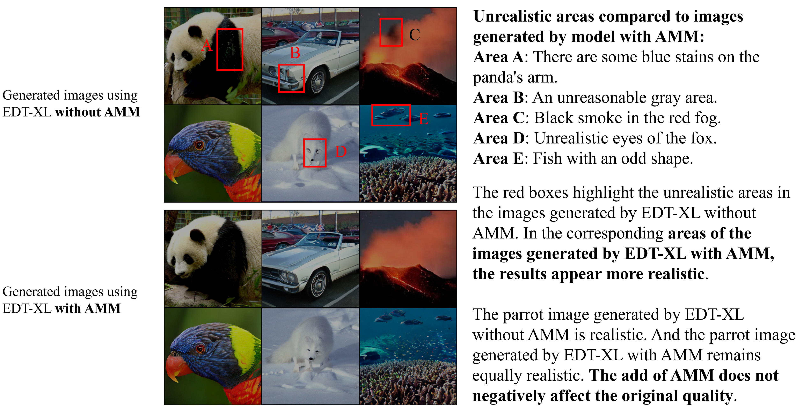

# EDT: An Efficient Diffusion Transformer Framework Inspired by Human-like Sketching

### [Paper](https://arxiv.org/abs/2410.23788) | [HuggingFace space](https://huggingface.co/trenkey/EDT)

## Introduction

Transformer-based Diffusion Probabilistic Models (DPMs) have shown more potential than CNN-based DPMs, yet their extensive computational requirements hinder widespread practical applications. To reduce the computation budget of transformer-based DPMs, this work proposes the **E**fficient **D**iffusion **T**ransformer (EDT) framework. The framework includes a lightweight-design diffusion model architecture, and a training-free Attention Modulation Matrix and its alternation arrangement in EDT inspired by human-like sketching. Additionally, we propose a token relation-enhanced masking training strategy tailored explicitly for EDT to augment its token relation learning capability. Our extensive experiments demonstrate the efficacy of EDT. The EDT framework reduces training and inference costs and surpasses existing transformer-based diffusion models in image synthesis performance, thereby achieving a significant overall enhancement. EDT achieved lower FID, EDT-S, EDT-B, and EDT-XL attained speed-ups of 3.93x, 2.84x, and 1.92x respectively in the training phase, and 2.29x, 2.29x, and 2.22x respectively in inference, compared to the corresponding sizes of MDTv2.




## Performance


| Model      | Dataset  | Resolution | Cost(Iter. × BS) | GFLOPs | FID-50K | Inception Score | Weight                                                                                                                                                               |
| ---------- | -------- | ---------- | ----------------- | ------ | ------- | --------------- | -------------------------------------------------------------------------------------------------------------------------------------------------------------------- |
| EDT-S/2    | ImageNet | 256x256    | 400k × 256       | 2.66   | 34.27   | 42.6            | [google](https://drive.google.com/file/d/1DkglqB4wxlHeDUkerk1G8KqaNcwA_oD-/view?usp=drive_link) ([baidu](https://pan.baidu.com/s/1s856mTUODjg6TcsDdMptwQ?pwd=gv0h)) |
| EDT-B/2    | ImageNet | 256x256    | 400k × 256       | 10.20  | 19.18   | 74.4            | [google](https://drive.google.com/file/d/1Zd2bx8JkRKOdRPFpY6PeOQY9zNcf_Fqv/view?usp=drive_link) ([baidu](https://pan.baidu.com/s/1EOBbcYrfk7oQfieUf68GgQ?pwd=8e33)) |
| EDT-B/2    | ImageNet | 256x256    | 1000k × 256      | 10.20  | 13.58   | 94.1            | [google](https://drive.google.com/file/d/1UDxgFqoEwGnLZMO__u-BdqzzZ_SolBTc/view?usp=drive_link) ([baidu](https://pan.baidu.com/s/1FEeQal8kkabRVi3rSi4fNQ?pwd=6vc0)) |
| EDT-XL/2   | ImageNet | 256x256    | 400k × 256       | 51.83  | 7.52    | 142.4           | [google](https://drive.google.com/file/d/1h583ejF6EUa31f7p34iSpBEjjDpdi5gC/view?usp=drive_link) ([baidu](https://pan.baidu.com/s/1E0IAIEkhBQxUNb717iJicg?pwd=rzgn)) |
| EDT-XL/2-G | ImageNet | 256x256    | 2000k × 256      | 51.83  | 3.54    | 355.8           | [google](https://drive.google.com/file/d/1hEZ7IrCuw9OWH0w_r5f_e8mkVZesC5Dj/view?usp=drive_link) ([baidu](https://pan.baidu.com/s/1jXbNwDI1Qyr5JCaunrVERQ?pwd=dkac)) |

More model weight ([google](https://drive.google.com/drive/folders/1YsXs6NBdCQHQOsD43ijbzukEPTVt6ZeV?usp=drive_link) ([baidu](https://pan.baidu.com/s/1N8j-lW3k5T-15JORFiqdmw?pwd=qh1p)))

## Setup environment

### 1. Download and set up the repo:

```bash
git clone https://github.com/xinwangChen/EDT.git
cd EDT
```

### 2. Download the pre-trained [VAE-ema](https://huggingface.co/stabilityai/sd-vae-ft-ema) or [VAE-mse](https://huggingface.co/stabilityai/sd-vae-ft-mse):

```bash
git clone https://huggingface.co/stabilityai/sd-vae-ft-ema
git clone https://huggingface.co/stabilityai/sd-vae-ft-mse
```

### 3. Create a Conda environment:

```bash
conda env create -f environment.yml
conda activate EDT
```

## Evaluation

### 1. Preparation of evaluation environment and data.

The evaluation code and pre-computed data are obtained from [ADM's TensorFlow evaluation suite](https://github.com/openai/guided-diffusion/tree/main/evaluations). Please follow the instructions in the `evaluations` folder of ADM to set up the evaluation environment and download [the reference dataset batches of ImageNet 256x256](https://openaipublic.blob.core.windows.net/diffusion/jul-2021/ref_batches/imagenet/256/VIRTUAL_imagenet256_labeled.npz).

### 2. Generate images using EDT.

The [`image_generator_ddp.py`](image_generator_ddp.py) script samples a large number of images from an EDT model with multiple GPUs. This script generates a folder of samples as well as a `xxx.npz` file which can be directly used with [ADM's TensorFlow evaluation suite](https://github.com/openai/guided-diffusion/tree/main/evaluations) to compute FID, Inception Score and other metrics.

For example, to generate 50000 images from a pre-trained EDT-S model with AMM on `N` GPUs, run:

```shell
torchrun --nnodes=1 --nproc_per_node=N image_generator_ddp.py --model EDT-S/2 --ckpt /path/save/checkpoint.pt --amm True --output-dir /path/save/samples --num-images 50000
```

### 3. Run the evaluation code and compute FID, Inception Score and other metrics:

```shell
python evaluator.py /path_of_eval_data/VIRTUAL_imagenet256_labeled.npz /path/save/samples/samples_50000x256x256x3.npz
```

### 4. Visualization.

You can also run the [`image_generator.py`](image_generator.py) to generate images of a specific class you want.

## Training

### 1. Preparation of data before training

To extract ImageNet features by VAE with `1` GPU on one node:

```bash
torchrun --nnodes=1 --nproc_per_node=1 extract_features.py --data-path /path/to/imagenet/train --features-path /path/to/save/features
```

### 2. Install Adan optimizer.

Install [Adan optimizer](https://github.com/sail-sg/Adan) [(paper)](https://arxiv.org/abs/2208.06677)

```
python -m pip install git+https://github.com/sail-sg/Adan.git
```

### 3. Begin training.

Training EDT-S with masking training strategy:

```shell
accelerate launch --multi_gpu --num_processes 8 train_mask_adan.py --results-dir /path/save/checkpoint --model EDT-S/2 --init-lr 1e-3 --feature-path /path/to/save/features --epochs 81
```

# Citation

```
@inproceedings{chen2024edt,
 title = {EDT: An Efficient Diffusion Transformer Framework Inspired by Human-like Sketching},
 author = {Chen, Xinwang and Liu, Ning and Zhu, Yichen and Feng, Feifei and Tang, Jian},
 booktitle = {Advances in Neural Information Processing Systems},
 volume = {37},
 pages = {134075--134106},
 year = {2024}
}
```

# Acknowledgement

This codebase is built based on the [DiT](https://github.com/facebookresearch/dit), [ADM](https://github.com/openai/guided-diffusion) and [MDT](https://github.com/sail-sg/MDT). Thanks!
